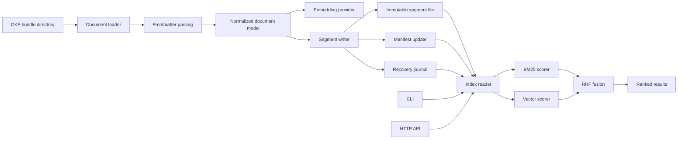
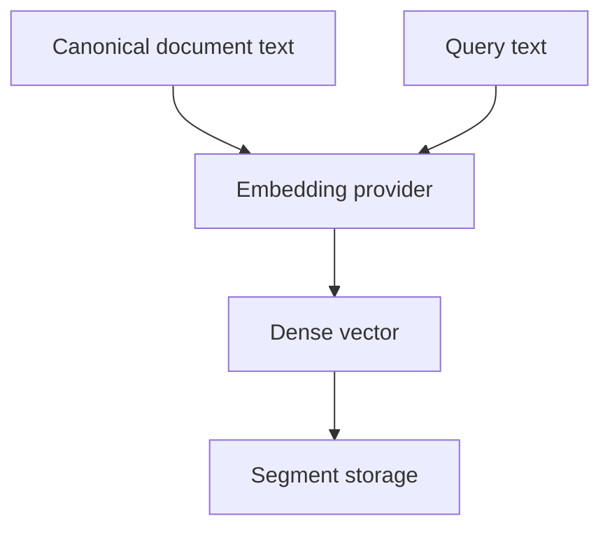
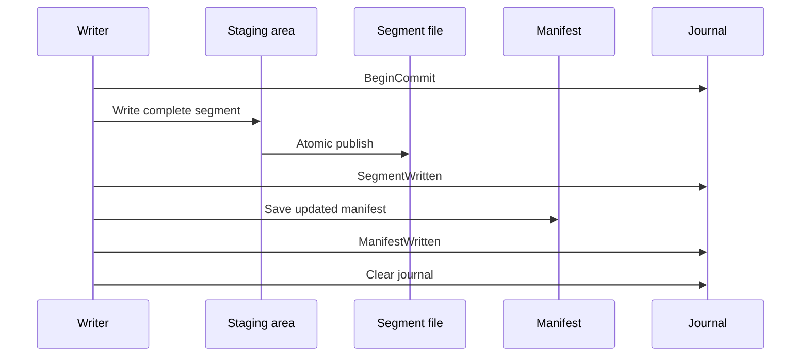
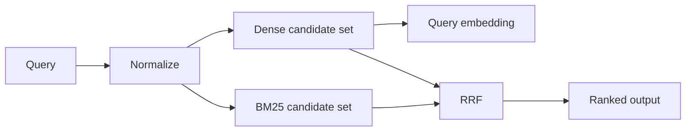

# rust-okf System Description

## Purpose

`rust-okf` is the Rust retrieval engine for OKF knowledge bundles. It indexes Markdown documents with YAML frontmatter, stores them in immutable on-disk segments, and serves lexical, vector, and hybrid search queries with low-latency reads and safe incremental writes.

The system is designed around four priorities:

- fast query execution
- atomic persistence
- recovery after partial writes
- clean separation between parsing, embedding, scoring, storage, and transport

## System Scope

Included:

 - document parsing and normalization
 - embedding provider abstraction
 - lexical scoring with BM25
 - dense scoring with FastEmbed-backed vectors
 - Reciprocal Rank Fusion
 - immutable segment storage
 - manifest and journal recovery
 - CLI and HTTP API surface

Excluded:

 - the outer Python bundle authoring CLI
 - unrelated repository tooling

## Architecture Overview

The engine keeps the ingestion and query paths separate, but both operate on the same manifest-driven segment store.

## Runtime Model

The process has two primary modes:

1. indexing mode, where OKF bundles are scanned and written into a new segment
2. query mode, where existing segments are loaded and searched

The same index structure supports both modes. A commit writes a fully materialized segment into place, updates the manifest, and records progress in the journal so partial updates can be recovered safely.

## Document Model

Each OKF document is normalized into an internal representation with:

- bundle path
- concept ID, derived from the bundle-relative file path without the `.md` suffix
- logical key
- title
- type
- tags
- timestamp
- other optional frontmatter fields
- canonical body text
- derived search text
- payload metadata for result rendering

The logical key identifies the stable document identity used for update and delete semantics. The engine preserves unknown frontmatter keys so it can round-trip producer-defined extensions without rejecting valid OKF content.

## Parsing and Normalization

The parser reads Markdown files with YAML frontmatter and produces a normalized document record.

Responsibilities:

- validate required and optional metadata
- normalize paths into a stable bundle-relative identity
- reject reserved concept filenames such as `index.md` and `log.md` as concept documents
- extract body text
- derive search text used for lexical and semantic retrieval
- preserve enough metadata for rendering search results
- preserve unknown frontmatter keys

Normalization is intentionally conservative. The index stores the original payload fields needed to explain a result and the canonical text needed to rank it.

## Embedding Layer

Dense retrieval is backed by FastEmbed by default.

The embedding abstraction hides:

- model initialization
- batch execution
- vector dimension handling
- normalization behavior
- backend-specific details

This keeps indexing and search independent from the specific embedding implementation. The rest of the engine consumes only embedded vectors and their dimension contract.

## Storage Model

The storage system is built around immutable segment files and a versioned manifest.

### On-disk layout

The current segment format is a compact binary file designed for mmap-backed reads.

Each `segment.bin` begins with:

- an 8-byte magic value: `OKFSEG04`
- a 32-bit format version
- 32-bit counts for documents, terms, and postings
- a 32-bit vector dimension
- a fixed offset table of 64-bit little-endian start/length pairs

The offset table points to five contiguous regions:

1. `docs`
2. `strings`
3. `terms`
4. `postings`
5. `vectors`

The file is read by mapping it into memory and interpreting the offset table directly. No secondary deserialization step is needed for query-time access.

### Segment contents

Each segment stores:

- per-document metadata encoded as fixed-size document entries
- a string pool containing UTF-8 text values
- lexical term metadata encoded as fixed-size term entries
- postings encoded as `(doc_index, tf)` pairs
- dense vectors encoded as little-endian `f32` values

The document entries reference strings by offset and length. Optional fields are represented as missing offsets. Tags are stored as a newline-delimited string in the string pool and split on read.

The layout is intentionally simple:

- fixed-size entry tables for docs and terms
- a shared string pool for textual fields
- contiguous postings storage for BM25 reconstruction
- contiguous vector storage for dense retrieval

### Manifest contents

The manifest is the authoritative index state. It records:

- active segments
- tombstones for deleted logical keys
- format version
- recovery state
- commit metadata

### Journal contents

The journal is used for crash recovery. It records commit progress so the engine can detect and reconcile interrupted writes on startup.

Journal entries are bincode-encoded and currently include:

- `BeginCommit { segment_id }`
- `SegmentWritten { segment_id, path }`
- `ManifestWritten { generation }`

The journal is stored separately from the manifest so a commit can be replayed or rolled back after interruption.

### Write path

1. build a new segment in a staging location
2. write the complete segment
3. atomically move or rename the staged files into place
4. update the manifest
5. clear the journal

This keeps the visible index state consistent even if the process exits mid-write.

## Recovery Model

Startup recovery checks the journal and manifest to determine the last consistent state.

Recovery handles:

- staged segments left behind by a crash
- partially completed commits
- manifest updates that were not finalized
- tombstone state that needs reconciliation

The design goal is to converge to the last fully committed state without requiring manual repair.

## Query Pipeline

Search uses a two-stage candidate generation model with fusion.

### Lexical retrieval

BM25 scores documents using term frequency and document frequency statistics.

### Dense retrieval

The query is embedded with the configured embedding provider and compared against stored document vectors.

### Fusion

Reciprocal Rank Fusion combines the ranked lexical and dense candidate lists into a final result order.

The scorers are intentionally independent so they can be tested and tuned separately.

## Update and Delete Semantics

Updates and deletes are logical operations over stable document identity.

- delete marks a logical key as a tombstone in the manifest
- update is implemented as delete plus reindex under the same logical key
- compaction later rewrites only live documents into a new segment

This avoids in-place mutation of segment files and keeps reads safe while writes happen.

## Compaction

Compaction is a separate maintenance pass.

It rewrites live documents from existing segments into a new segment and then replaces the segment list in the manifest.

Benefits:

- removes dead data
- improves search locality
- reduces segment count
- preserves the immutable segment model

## Public Interfaces

The crate exposes two main interfaces:

- a CLI binary named `okf`
- an HTTP API with explicit request and response types

### CLI

The CLI supports:

- configuration
- indexing bundles
- updating bundles
- deleting documents
- searching
- compaction
- serving the HTTP API

### HTTP API

The HTTP layer exposes routes for:

- health checks
- search
- document ingestion
- document update
- document deletion
- OpenAPI schema access

The API types are explicit so integration clients can rely on a stable request/response contract.

## Module Responsibilities

The project is split into narrow modules:

- `src/okf.rs`: OKF document parsing and normalization
- `src/embedding.rs`: FastEmbed-backed embedding provider abstraction
- `src/bm25.rs`: lexical scoring and term statistics
- `src/storage.rs`: manifests, journals, segments, and recovery
- `src/index.rs`: indexing, search, update, delete, and compaction orchestration
- `src/api.rs`: HTTP server implementation
- `src/schema.rs`: API request and response types
- `src/openapi.rs`: OpenAPI document generation

This separation keeps storage, scoring, and transport isolated.

## Testing Strategy

The test suite is organized around correctness at the boundaries:

- parser tests for frontmatter and body extraction
- storage tests for manifest commits and recovery
- BM25 tests for ranking correctness
- vector tests for similarity ranking
- RRF tests for fusion order
- API tests for route behavior
- CLI tests for command behavior
- end-to-end tests for indexing, update, delete, and search

The system is intentionally tested as a composed whole, not only as isolated units.

## Performance Model

Performance-sensitive parts of the engine are benchmarked with Criterion.

Benchmarks cover:

- index build throughput
- hybrid query latency
- segment reopen time
- bundle load time

The current benchmark numbers are published in `rust-okf/README.md` and should be refreshed after meaningful storage, scoring, or embedding changes.

## Spec Alignment

`rust-okf` is an implementation of the OKF spec, not a replacement for it. The engine follows the spec by:

- treating `type` as required input metadata
- preserving producer-defined frontmatter extensions
- identifying concepts by bundle-relative path without the `.md` suffix
- rejecting reserved concept documents such as `index.md` and `log.md`
- accepting bundle-relative links as stable references in content

The storage format described here is an engine implementation detail layered on top of OKF content, not part of the OKF specification itself.

## Operational Guarantees

The engine is built to provide:

- stable reads from immutable segments
- atomic visible state changes via manifest updates
- crash recovery through a journal
- incremental updates with tombstones
- deterministic query ranking within the same index state

## Extension Points

The current architecture leaves room for future improvements:

- segment compaction policies
- true ANN search inside segments
- sharding
- additional metadata filters
- alternative embedding providers
- streaming or paginated result delivery

Those additions can fit behind the existing storage and scoring boundaries without changing the overall engine shape.

## Summary

`rust-okf` is a small, performance-oriented retrieval engine built around immutable segments, a versioned manifest, recovery journaling, FastEmbed embeddings, BM25 lexical scoring, and RRF hybrid ranking. The implementation is intentionally narrow so the hot path stays fast and the storage model stays explainable. It respects the OKF spec by treating `type` as required, preserving unknown frontmatter keys, using bundle-relative concept IDs, and rejecting reserved concept filenames from the concept set.
